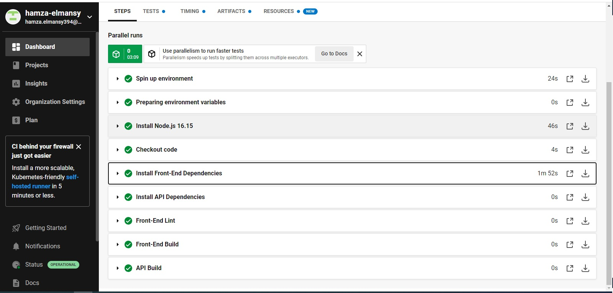
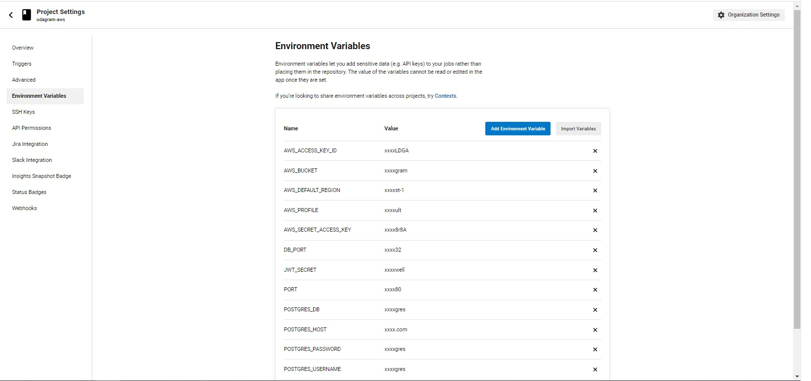
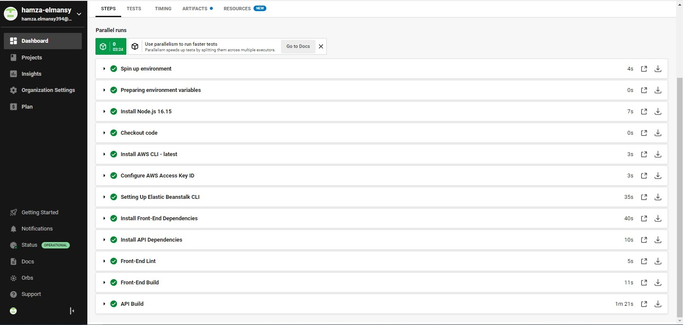
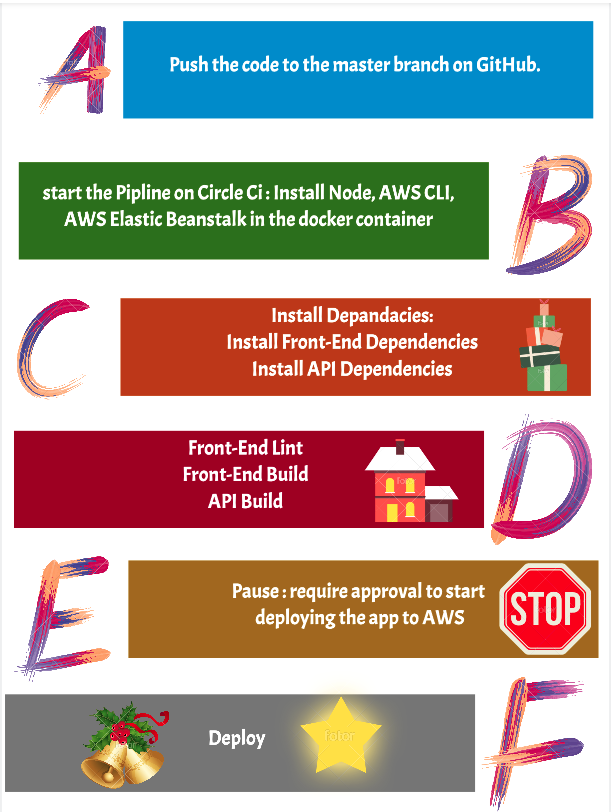

# CI/CD ?
- The main concepts attributed to CI/CD are continuous integration, continuous delivery, and continuous deployment.

### CI/CD explain

### CI/CD in the project
- you just need to attach your project from your github then add the variables from the .env which you create and i already explained

- you need to add the environment variables to CircleCi:

### My pipline

`
version: 2.1
orbs:
  # orgs contain basc recipes and reproducible actions (install node, aws, etc.)
  node: circleci/node@5.0.3
  eb: circleci/aws-elastic-beanstalk@2.0.1
  aws-cli: circleci/aws-cli@3.1.1
  # different jobs are calles later in the workflows sections
jobs:
  build:
    docker:
      # the base image can run most needed actions with orbs
      - image: "cimg/node:14.15"
    steps:
      # install node and checkout code
      - node/install:
          node-version: '16.15'         
      - checkout
      # Use root level package.json to install dependencies in the frontend app
      - run:
          name: Install Front-End Dependencies
          command: |
            echo "NODE --version" 
            echo $(node --version)
            echo "NPM --version" 
            echo $(npm --version)
            npm run frontend:install
      # TODO: Install dependencies in the the backend API          
      - run:
          name: Install API Dependencies
          command: |
           npm run api:install
      # TODO: Lint the frontend
      - run:
          name: Front-End Lint
          command: |
            npm run frontend:lint
      # TODO: Build the frontend app
      - run:
          name: Front-End Build
          command: |
            npm run frontend:build
      # TODO: Build the backend API      
      - run:
          name: API Build
          command: |
            npm run api:build
  # deploy step will run only after manual approval
  deploy:
    docker:
      - image: "cimg/base:stable"
      # more setup needed for aws, node, elastic beanstalk
    steps:
      - node/install:
          node-version: '14.15' 
      - eb/setup
      - aws-cli/setup
      - checkout
      - run:
          name: Deploy App
          # TODO: Install, build, deploy in both apps
          command: |
            npm run deploy
            
workflows:
  udagram:
    jobs:
      - build
      - hold:
          filters:
            branches:
              only:
                - master
          type: approval
          requires:
            - build
      - deploy:
          requires:
            - hold
`

### configure 
1- Orbs
2- Steps 

`
  # install node and checkout code
  - node/install:
      node-version: '14.15'
  - checkout
  - aws-cli/setup
  - eb/setup
`
3- Deploy